# device_systems API

**Actividad:** GA1-220501096-01-AA1-EV09 – FastAPI con SQLAlchemy: Persistencia de Datos y CRUD

**Rama:** `ev09`

API REST con **FastAPI** y **SQLAlchemy** para gestionar usuarios con persistencia en **SQLite**.

---

## Descripción

`device_systems` evoluciona desde datos en memoria (EV08) hacia persistencia real en base de datos. Los usuarios se almacenan en `device_systems.db` mediante el ORM SQLAlchemy.

- CRUD completo sobre base de datos
- Modelo SQLAlchemy `User` con constraints (`unique`, `nullable`)
- Schemas Pydantic separados del modelo de BD
- Sesión de BD inyectada con `Depends(get_db)`
- Filtros por rol y estado, orden por nombre o `created_at`

---

## Tecnologías

| Tecnología | Uso |
|------------|-----|
| FastAPI | API REST |
| SQLAlchemy | ORM y persistencia |
| SQLite | Base de datos local |
| Pydantic v2 | Validación entrada/salida |
| Uvicorn | Servidor |

---

## Estructura del proyecto

```
device_systems/
├── app/
│   ├── main.py
│   ├── database/
│   │   └── connection.py      # Engine, SessionLocal, Base, get_db
│   ├── models/
│   │   └── user_model.py      # Modelo SQLAlchemy (tabla users)
│   ├── schemas/
│   │   └── user_schema.py     # Schemas Pydantic
│   ├── routes/
│   │   └── user_routes.py
│   ├── services/
│   │   └── user_service.py
│   └── dependencies/
│       ├── database_dependency.py
│       └── user_dependencies.py
├── device_systems.db          # Generada al ejecutar (no subir a git)
├── requirements.txt
└── README.md
```

---

## Modelo SQLAlchemy vs Schema Pydantic

| | Modelo SQLAlchemy (`User`) | Schema Pydantic (`UserResponse`) |
|--|---------------------------|----------------------------------|
| Uso | Tabla en base de datos | JSON de la API |
| Campos BD | `Column`, constraints | Validación de tipos |
| Ejemplo | `email` unique en SQLite | `email` formato EmailStr |
| `created_at` | `DateTime` en BD | `datetime` en respuesta |

El servicio convierte: BD → modelo SQLAlchemy → `UserResponse` con `from_attributes=True`.

---

## Instalación y ejecución

```bash
git checkout ev09
python -m venv venv
venv\Scripts\activate
pip install -r requirements.txt
python -m uvicorn app.main:app --reload
```

| Recurso | URL |
|---------|-----|
| API | http://127.0.0.1:8000 |
| Swagger | http://127.0.0.1:8000/docs |
| ReDoc | http://127.0.0.1:8000/redoc |

Al iniciar se crea `device_systems.db` y se insertan 4 usuarios de ejemplo si la tabla está vacía.

---

## Endpoints

| Método | Ruta | Código éxito |
|--------|------|--------------|
| GET | `/users` | 200 |
| GET | `/users?role=admin` | 200 |
| GET | `/users?is_active=true` | 200 |
| GET | `/users?order_by=name&sort=asc` | 200 |
| GET | `/users/{id}` | 200 |
| POST | `/users` | 201 |
| PUT | `/users/{id}` | 200 |
| PATCH | `/users/{id}` | 200 |
| DELETE | `/users/{id}` | 204 |

---

## Códigos de error

| Caso | Código |
|------|--------|
| Usuario no encontrado | 404 |
| Email duplicado | 400 |
| PATCH vacío | 400 |
| Rol no permitido | 400 |
| Validación Pydantic | 422 |

---

## Dependencia de base de datos

```python
def get_db():
    db = SessionLocal()
    try:
        yield db
    finally:
        db.close()
```

Usada en rutas: `Depends(get_db)` → inyecta sesión SQLAlchemy al servicio.

---

## Capturas (evidencias)

### Estructura del proyecto

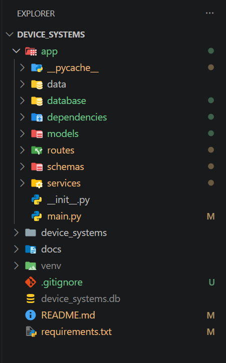

Carpetas `database/`, `models/`, `schemas/`, `services/` y `dependencies/`.

---

### Base de datos generada

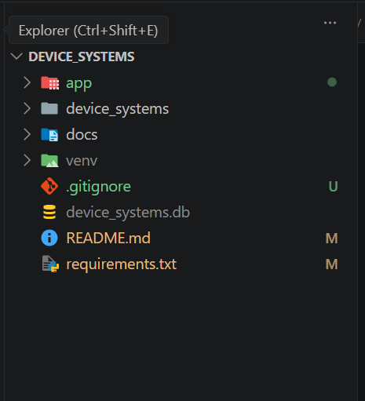

Archivo SQLite `device_systems.db` creado al ejecutar el servidor.

---

### Swagger UI v3.0.0

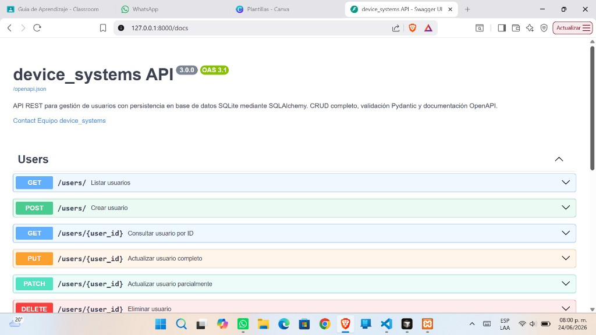

Endpoints GET, POST, PUT, PATCH y DELETE con persistencia SQLAlchemy.

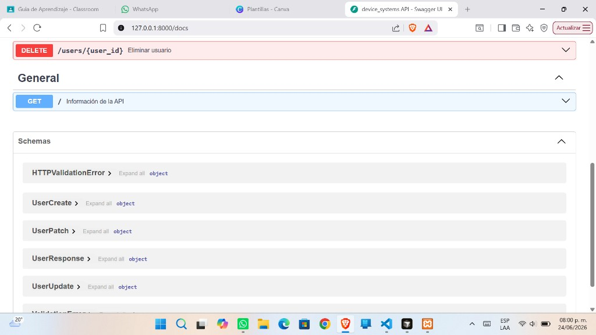

Sección de endpoints y schemas documentados.

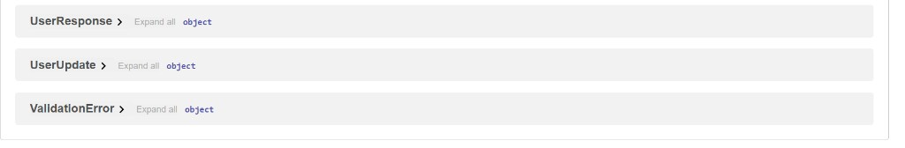

Modelos `UserCreate`, `UserUpdate`, `UserPatch` y `UserResponse`.

---

### GET /users – Filtros y ordenamiento

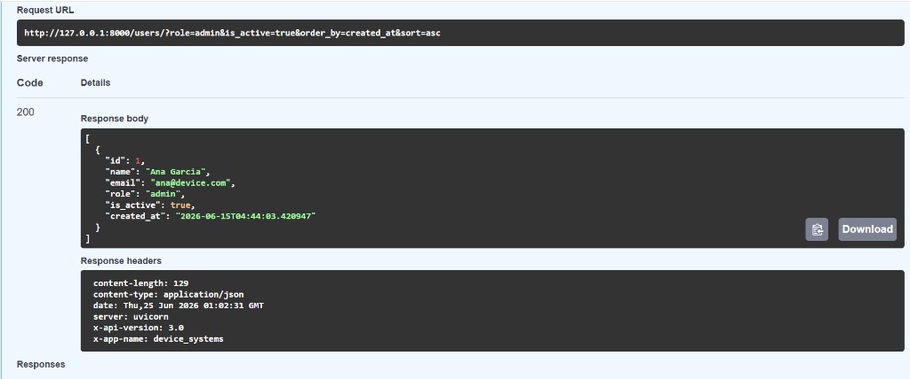

Filtro por `role=admin`, `is_active=true`, orden por `created_at`. Respuesta **200** con campo `created_at`.

---

### GET /users/{user_id}

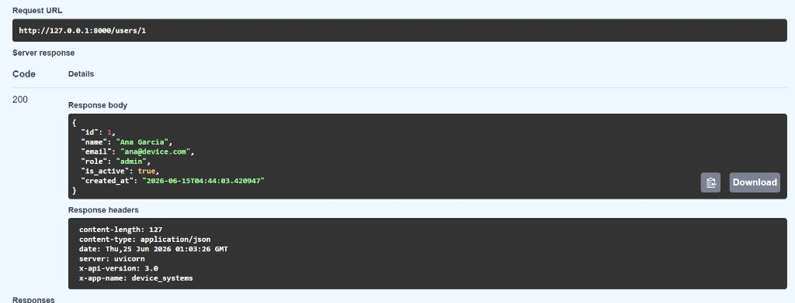

Consulta por ID con respuesta **200 OK** desde la base de datos.

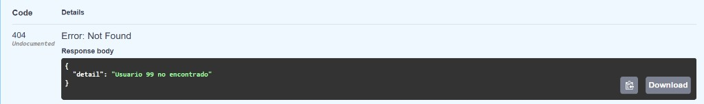

Usuario inexistente con respuesta **404 Not Found**.

---

### POST /users

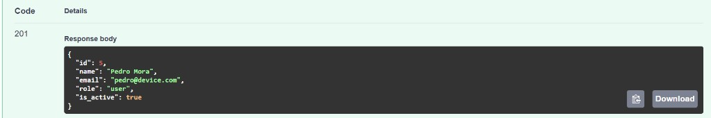

Creación de usuario con respuesta **201 Created**.

---

### PUT /users/{user_id}

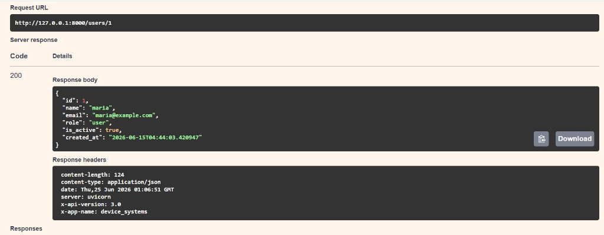

Actualización completa con respuesta **200 OK** (`x-api-version: 3.0`).

---

### PATCH /users/{user_id}

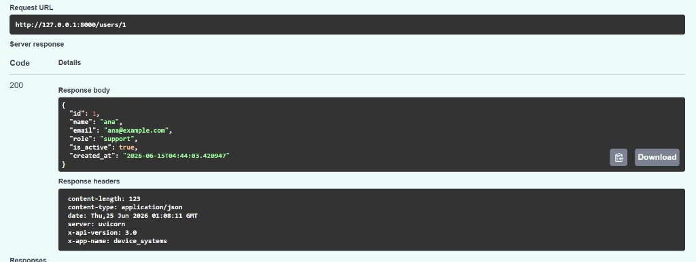

Actualización parcial con respuesta **200 OK**.

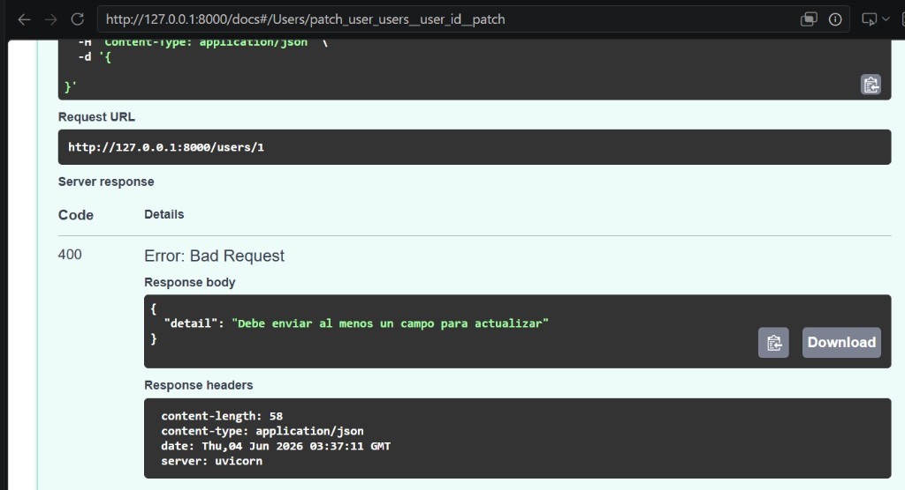

Body vacío `{}` con respuesta **400 Bad Request**.

---

### DELETE /users/{user_id}

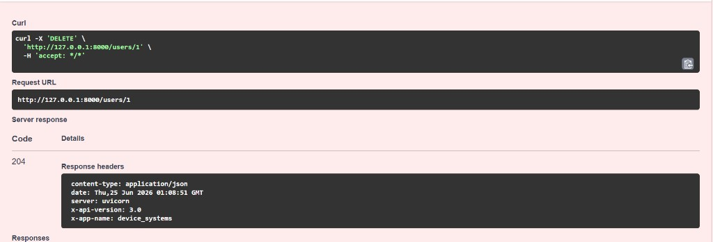

Eliminación exitosa con respuesta **204 No Content**.

---

### Errores controlados

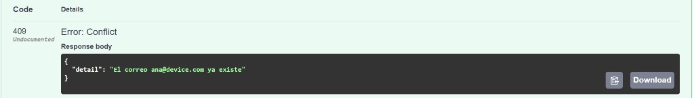

Correo electrónico duplicado con respuesta **400 Bad Request**.

---

### ReDoc

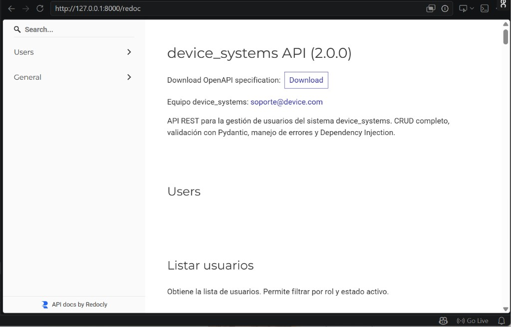

Documentación alternativa en `/redoc`.

---

## Ramas

| Rama | Contenido |
|------|-----------|
| `main` | EV07 – GET/POST |
| `ev08` | CRUD en memoria |
| `ev09` | SQLAlchemy + SQLite |

## Reflexión

La persistencia con SQLAlchemy permite que los datos sobrevivan al reinicio del servidor. Separar modelo de BD y schemas Pydantic mantiene la API limpia: la base de datos puede cambiar sin alterar el contrato JSON de los endpoints.

## Video

https://youtu.be/Nd36fHtzmqc?si=IGVaa6i2UHqIJx0x
