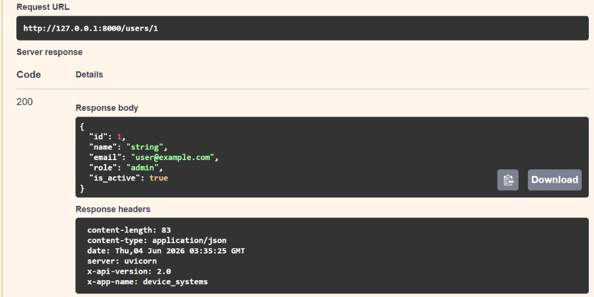
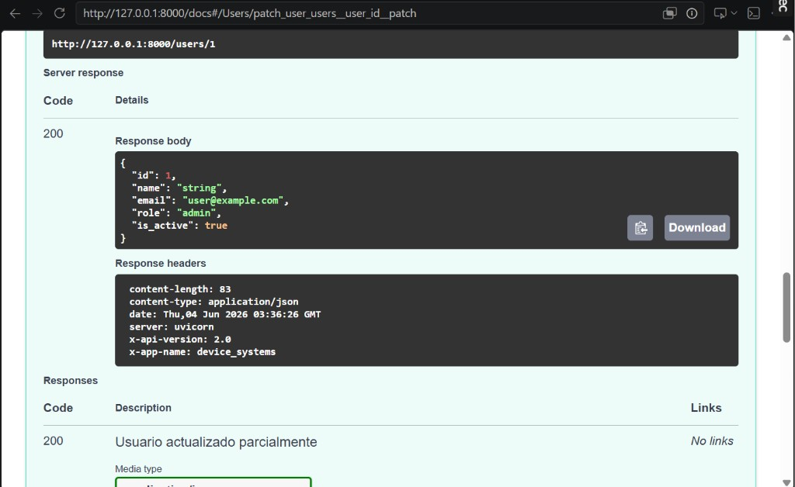
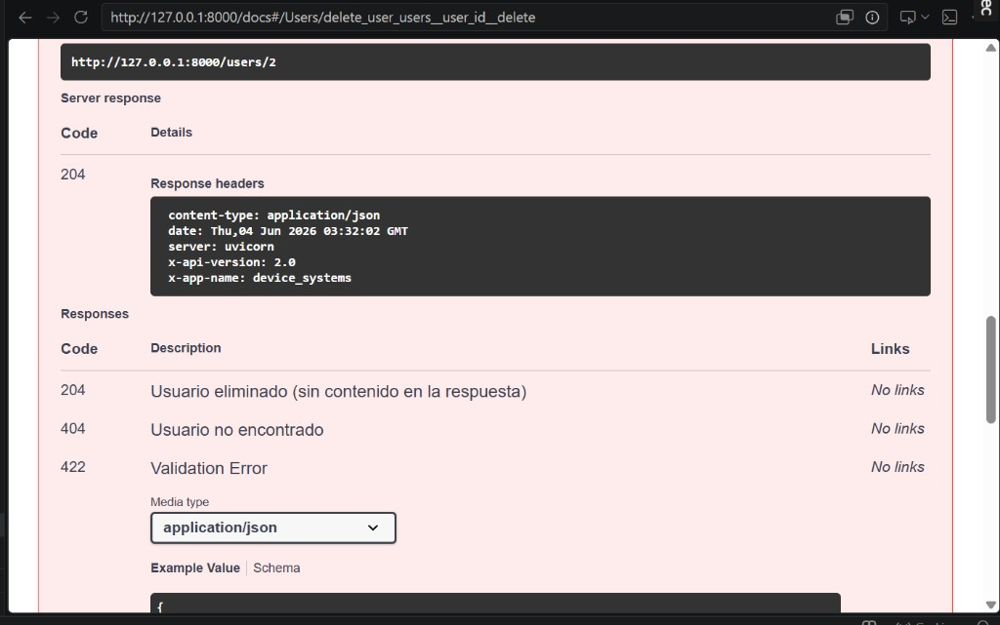

# device_systems API

**Actividad:** GA1-220501096-01-AA1-EV08 – FastAPI Intermedio: CRUD completo, manejo de errores, Swagger/OpenAPI y Dependency Injection

**Rama:** `ev08` (EV07 permanece en `main`)

API REST con **FastAPI** para gestión de usuarios: CRUD completo, capas separadas, `Depends()`, códigos HTTP y documentación OpenAPI.

---

## Descripción

`device_systems` evoluciona desde GET/POST hacia una API profesional que permite:

- Crear, listar, consultar, actualizar y eliminar usuarios
- Filtrar por `role` e `is_active`
- Validar datos con Pydantic v2
- Manejar errores con `HTTPException`
- Reutilizar lógica con **Dependency Injection**
- Documentar endpoints en Swagger UI y ReDoc

---

## Tecnologías utilizadas

| Tecnología | Uso |
|------------|-----|
| Python 3.10+ | Lenguaje |
| FastAPI | Framework API REST |
| Uvicorn | Servidor ASGI |
| Pydantic v2 | Validación y serialización |
| Git | Control de versiones (ramas `main` / `ev08`) |

---

## Estructura del proyecto

```
device_systems/
├── app/
│   ├── main.py
│   ├── routes/
│   │   └── user_routes.py       # Endpoints HTTP (capa delgada)
│   ├── schemas/
│   │   └── user_schema.py       # Modelos Pydantic
│   ├── services/
│   │   └── user_service.py      # Lógica de negocio
│   ├── dependencies/
│   │   └── user_dependencies.py # Depends() reutilizables
│   └── data/
│       └── users_db.py          # Base de datos en memoria
├── requirements.txt
└── README.md
```

| Capa | Responsabilidad |
|------|-----------------|
| `routes` | Define endpoints y delega al servicio |
| `schemas` | Validación entrada/salida |
| `services` | Reglas de negocio y errores |
| `dependencies` | Funciones inyectables con `Depends()` |
| `data` | Acceso a `fake_db` |

---

## Instalación y ejecución

```bash
git clone https://github.com/TU_USUARIO/device_systems.git
cd device_systems
git checkout ev08

python -m venv venv
venv\Scripts\activate          # Windows


pip install -r requirements.txt
python -m uvicorn app.main:app --reload
```

| Recurso | URL |
|---------|-----|
| API | http://127.0.0.1:8000 |
| Swagger UI | http://127.0.0.1:8000/docs |
| ReDoc | http://127.0.0.1:8000/redoc |

---

## Tabla de endpoints

| Método | Ruta | Descripción | Código éxito |
|--------|------|-------------|--------------|
| GET | `/users` | Listar usuarios (filtros opcionales) | 200 |
| GET | `/users/{user_id}` | Consultar por ID | 200 |
| POST | `/users` | Crear usuario | 201 |
| PUT | `/users/{user_id}` | Actualización completa | 200 |
| PATCH | `/users/{user_id}` | Actualización parcial | 200 |
| DELETE | `/users/{user_id}` | Eliminar usuario | 204 |

---

## Códigos de estado HTTP

| Código | Uso |
|--------|-----|
| 200 | Consulta o actualización exitosa |
| 201 | Usuario creado |
| 204 | Usuario eliminado (sin cuerpo) |
| 400 | Correo duplicado, rol inválido, PATCH vacío |
| 401 | Clave API inválida (header opcional) |
| 404 | Usuario no encontrado |
| 422 | Datos inválidos (Pydantic) |

---

## Ejemplos de peticiones

### GET /users

```http
GET http://127.0.0.1:8000/users
```

### GET /users?role=admin

```http
GET http://127.0.0.1:8000/users?role=admin
```

### GET /users/1

```json
{"id": 1, "name": "Ana Garcia", "email": "ana@device.com", "role": "admin", "is_active": true}
```

### POST /users

```json
{
  "name": "Pedro Mora",
  "email": "pedro@device.com",
  "role": "user",
  "is_active": true
}
```

Respuesta: **201 Created**

### PUT /users/1

```json
{
  "name": "Ana Garcia Actualizada",
  "email": "ana.nueva@device.com",
  "role": "admin",
  "is_active": true
}
```

Respuesta: **200 OK**

### PATCH /users/2

```json
{"role": "support"}
```

Respuesta: **200 OK**

### DELETE /users/5

Respuesta: **204 No Content** (sin cuerpo)

---

## Manejo de errores

| Escenario | Código | Ejemplo `detail` |
|-----------|--------|------------------|
| Usuario no encontrado | 404 | `"Usuario no encontrado"` |
| Correo duplicado | 400 | `"El correo ... ya está registrado"` |
| Rol no permitido | 400 | `"Rol no permitido: ..."` |
| PATCH sin campos | 400 | `"Debe enviar al menos un campo para actualizar"` |
| Datos inválidos | 422 | Respuesta automática Pydantic |

---

## Dependency Injection (`Depends()`)

Archivo: `app/dependencies/user_dependencies.py`

| Dependencia | Función |
|-------------|---------|
| `get_user_service()` | Instancia del servicio de usuarios |
| `get_user_or_404()` | Obtiene usuario o lanza 404 |
| `validate_email_not_exists()` | Valida correo único |
| `validate_role()` | Valida rol permitido |
| `get_api_config()` | Configuración y cabeceras |
| `set_response_headers()` | Agrega `X-App-Name` y `X-API-Version` |
| `verify_api_key()` | Autenticación simulada (`X-API-Key`) |

Ejemplo en rutas:

```python
def get_user(user: Annotated[dict, Depends(get_user_or_404)]):
    return user
```

Cabeceras en respuestas:

```
X-App-Name: device_systems
X-API-Version: 2.0
```

Autenticación opcional: header `X-API-Key: device-systems-key`

---

## Capturas de Swagger UI y ReDoc

### Vista general Swagger (v2.0.0)


Endpoints GET, POST, PUT, PATCH y DELETE del recurso Users.

---

### ReDoc


Documentación alternativa en http://127.0.0.1:8000/redoc con versión **2.0.0**.

---

### GET /users


Listado de usuarios con respuesta **200 OK**.

---

### GET /users/{user_id}


Consulta por ID con respuesta **200 OK** y cabeceras `X-API-Version: 2.0`.


Usuario inexistente con respuesta **404 Not Found**.

---

### POST /users


Creación de usuario con respuesta **201 Created**.

---

### PUT /users/{user_id}



Actualización completa con respuesta **200 OK**.

---

### PATCH /users/{user_id}



Actualización parcial con respuesta **200 OK**.


Body vacío `{}` con respuesta **400 Bad Request**.

---

### DELETE /users/{user_id}



Eliminación exitosa con respuesta **204 No Content** y cabeceras personalizadas.

---

### Errores controlados


Ejemplo de error controlado (correo duplicado, validación o autenticación).

---

## Pruebas funcionales

### Casos exitosos

- GET /users, GET /users?role=admin, GET /users/1
- POST /users, PUT /users/1, PATCH /users/2, DELETE /users/5

### Casos de error

- GET /users/99 → 404
- POST correo repetido → 400
- POST datos inválidos → 422
- PUT /users/99 → 404
- PATCH /users/1 con `{}` → 400
- DELETE /users/99 → 404

---

## Ramas del repositorio

| Rama | Contenido |
|------|-----------|
| `main` | EV07 – GET y POST, estructura básica |
| `ev08` | EV08 – CRUD completo, capas, Depends(), v2.0 |

```bash
# Ver EV07
git checkout main

# Ver EV08
git checkout ev08
```

---

## Reflexión final

Este proyecto muestra la evolución de una API REST básica hacia una solución más profesional. La separación en capas facilita el mantenimiento; `HTTPException` unifica los errores; `Depends()` evita duplicar validaciones; y Swagger/ReDoc documentan la API automáticamente.

La rama `main` conserva la evidencia de EV07; la rama `ev08` concentra la entrega de la actividad intermedia sin mezclar ambas versiones.

## Video 

https://youtu.be/kAr74iHg6eM?si=lpl7vf5WRLH8VGvQ
