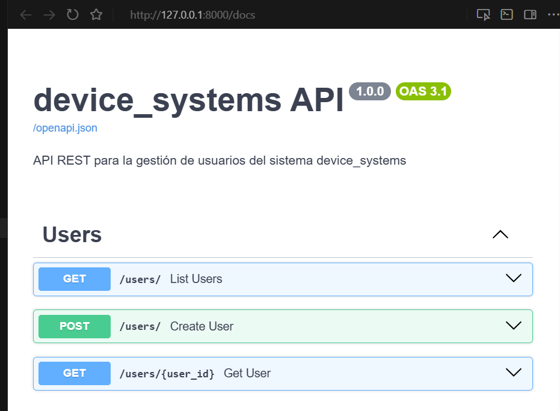
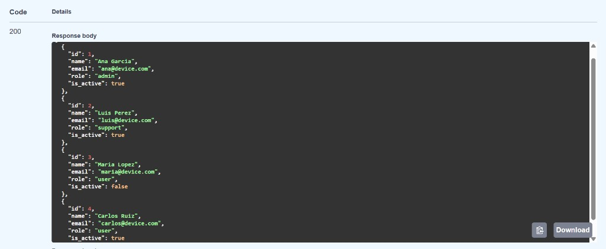
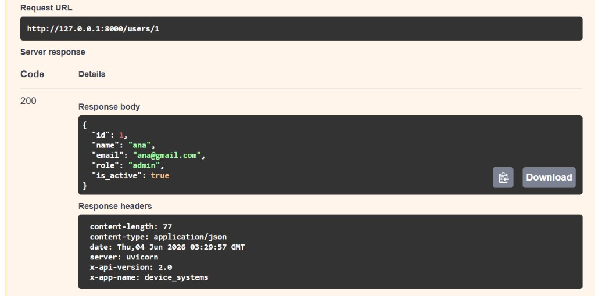

# device_systems – Fundamentos de FastAPI

**Actividad:** GA1-220501096-01-AA1-EV07 – Fundamentos de FastAPI: API REST para Gestión de Usuarios

API REST construida con **FastAPI** para la gestión de usuarios del sistema `device_systems`.

---

## Descripción de la aplicación

`device_systems` es una aplicación backend que expone un recurso `/users` para administrar usuarios del sistema. La API permite:

- Listar todos los usuarios
- Consultar un usuario por ID (Path Parameter)
- Filtrar usuarios por rol o estado activo (Query Parameters)
- Registrar nuevos usuarios con validación de datos
- Evitar correos electrónicos duplicados
- Retornar respuestas estandarizadas con `response_model`
- Incluir cabeceras HTTP personalizadas en cada respuesta

La documentación interactiva se genera automáticamente con **Swagger UI** al ejecutar el servidor.

---

## Tecnologías utilizadas

| Tecnología | Uso |
|------------|-----|
| Python 3.10+ | Lenguaje de programación |
| FastAPI | Framework web para construir la API REST |
| Uvicorn | Servidor ASGI para ejecutar la aplicación |
| Pydantic v2 | Validación y serialización de datos |
| Git / GitHub | Control de versiones y entrega del proyecto |

---

## Estructura del proyecto

```
device_systems/
├── app/
│   ├── main.py                 # Configuración inicial de FastAPI
│   ├── schemas/
│   │   └── user_schema.py      # Modelos Pydantic de entrada y salida
│   └── routes/
│       └── user_routes.py      # Endpoints GET y POST del recurso users
├── requirements.txt
└── README.md
```

### Organización del código

- **`main.py`**: Crea la instancia de FastAPI, registra las rutas y expone el endpoint raíz `/`.
- **`user_schema.py`**: Define los modelos `UserCreate` (entrada) y `UserResponse` (salida) con validaciones Pydantic.
- **`user_routes.py`**: Contiene los endpoints HTTP, la base de datos simulada en memoria y la lógica de filtrado.

---

## Modelos Pydantic

### UserCreate (entrada – POST)

| Campo | Tipo | Validación |
|-------|------|------------|
| `name` | string | Obligatorio, mínimo 3 caracteres |
| `email` | EmailStr | Formato de correo válido |
| `role` | string | Solo valores permitidos: `admin`, `support`, `user` |
| `is_active` | boolean | Valor booleano (por defecto `true`) |

### UserResponse (salida – GET y POST)

| Campo | Tipo | Descripción |
|-------|------|-------------|
| `id` | int | Identificador único del usuario |
| `name` | string | Nombre del usuario |
| `email` | string | Correo electrónico |
| `role` | string | Rol en el sistema |
| `is_active` | boolean | Estado activo/inactivo |

El `response_model` garantiza que la API solo exponga los campos definidos y oculte datos internos de la base de datos simulada.

---

## Instalación de dependencias

```bash
# Clonar el repositorio
git clone https://github.com/TU_USUARIO/device_systems.git
cd device_systems

# Crear entorno virtual
python -m venv venv

# Activar entorno virtual
# Windows:
venv\Scripts\activate
# Linux / macOS:
source venv/bin/activate

# Instalar dependencias
pip install -r requirements.txt
```

**Contenido de `requirements.txt`:**

```
fastapi>=0.115.0
uvicorn[standard]>=0.30.0
pydantic[email]>=2.0.0
```

---

## Ejecución del servidor

```bash
uvicorn app.main:app --reload
```

| Recurso | URL |
|---------|-----|
| API | http://127.0.0.1:8000 |
| Swagger UI | http://127.0.0.1:8000/docs |
| ReDoc | http://127.0.0.1:8000/redoc |

---

## Tabla de endpoints

| Método | Ruta | Descripción | Código de éxito |
|--------|------|-------------|-----------------|
| GET | `/` | Información general de la API | 200 OK |
| GET | `/users` | Listar todos los usuarios | 200 OK |
| GET | `/users?role=admin` | Filtrar usuarios por rol | 200 OK |
| GET | `/users?is_active=true` | Filtrar usuarios por estado activo | 200 OK |
| GET | `/users/{user_id}` | Consultar un usuario por ID | 200 OK |
| POST | `/users` | Registrar un nuevo usuario | 201 Created |

---

## Cabeceras HTTP personalizadas

Todas las respuestas del recurso `/users` incluyen las siguientes cabeceras:

```
X-App-Name: device_systems
X-API-Version: 1.0
```

Estas cabeceras identifican la aplicación y la versión de la API en cada respuesta HTTP.

---

## Ejemplos de peticiones y respuestas

### GET /users – Listar todos los usuarios

**Petición:**

```http
GET http://127.0.0.1:8000/users
```

**Respuesta `200 OK`:**

```json
[
  {"id": 1, "name": "Ana Garcia",  "email": "ana@device.com",    "role": "admin",   "is_active": true},
  {"id": 2, "name": "Luis Perez",  "email": "luis@device.com",   "role": "support", "is_active": true},
  {"id": 3, "name": "Maria Lopez", "email": "maria@device.com",  "role": "user",    "is_active": false},
  {"id": 4, "name": "Carlos Ruiz", "email": "carlos@device.com", "role": "user",    "is_active": true}
]
```

---

### GET /users?role=admin – Filtrar por rol (Query Parameter)

**Petición:**

```http
GET http://127.0.0.1:8000/users?role=admin
```

**Respuesta `200 OK`:**

```json
[
  {"id": 1, "name": "Ana Garcia", "email": "ana@device.com", "role": "admin", "is_active": true}
]
```

---

### GET /users?is_active=true – Filtrar por estado (Query Parameter)

**Petición:**

```http
GET http://127.0.0.1:8000/users?is_active=true
```

**Respuesta `200 OK`:** Retorna solo los usuarios con `is_active` en `true`.

---

### GET /users/{user_id} – Consultar por ID (Path Parameter)

**Petición:**

```http
GET http://127.0.0.1:8000/users/1
```

**Respuesta `200 OK`:**

```json
{
  "id": 1,
  "name": "Ana Garcia",
  "email": "ana@device.com",
  "role": "admin",
  "is_active": true
}
```

**Error `404 Not Found` (usuario inexistente):**

```json
{
  "detail": "Usuario 99 no encontrado"
}
```

---

### POST /users – Crear un nuevo usuario

**Petición:**

```http
POST http://127.0.0.1:8000/users
Content-Type: application/json

{
  "name": "Pedro Mora",
  "email": "pedro@device.com",
  "role": "user",
  "is_active": true
}
```

**Respuesta `201 Created`:**

```json
{
  "id": 5,
  "name": "Pedro Mora",
  "email": "pedro@device.com",
  "role": "user",
  "is_active": true
}
```

---

## Evidencia de validaciones y errores

### Correo electrónico duplicado – `409 Conflict`

**Petición:**

```http
POST http://127.0.0.1:8000/users
Content-Type: application/json

{
  "name": "Pedro Duplicado",
  "email": "ana@device.com",
  "role": "user",
  "is_active": true
}
```

**Respuesta:**

```json
{
  "detail": "El correo ana@device.com ya existe"
}
```

---

### Nombre demasiado corto – `422 Unprocessable Entity`

**Petición:**

```http
POST http://127.0.0.1:8000/users
Content-Type: application/json

{
  "name": "Jo",
  "email": "nuevo@device.com",
  "role": "user",
  "is_active": true
}
```

**Respuesta (validación automática de Pydantic):**

```json
{
  "detail": [
    {
      "type": "string_too_short",
      "loc": ["body", "name"],
      "msg": "String should have at least 3 characters",
      "input": "Jo"
    }
  ]
}
```

---

### Rol no permitido – `422 Unprocessable Entity`

**Petición:**

```http
POST http://127.0.0.1:8000/users
Content-Type: application/json

{
  "name": "Usuario Test",
  "email": "test@device.com",
  "role": "superadmin",
  "is_active": true
}
```

**Respuesta:**

```json
{
  "detail": [
    {
      "type": "literal_error",
      "loc": ["body", "role"],
      "msg": "Input should be 'admin', 'support' or 'user'"
    }
  ]
}
```

---

### Correo con formato inválido – `422 Unprocessable Entity`

**Petición:**

```http
POST http://127.0.0.1:8000/users
Content-Type: application/json

{
  "name": "Usuario Test",
  "email": "correo-invalido",
  "role": "user",
  "is_active": true
}
```

**Respuesta:**

```json
{
  "detail": [
    {
      "type": "value_error",
      "loc": ["body", "email"],
      "msg": "value is not a valid email address"
    }
  ]
}
```

---

## Pruebas funcionales

La API fue probada desde:

- **Swagger UI** → http://127.0.0.1:8000/docs
- **Postman / Thunder Client** → peticiones HTTP manuales

### Checklist de pruebas

| Prueba | Resultado |
|--------|-----------|
| GET /users – listar usuarios | ✅ |
| GET /users?role=admin – filtrar por rol | ✅ |
| GET /users?is_active=false – filtrar por estado | ✅ |
| GET /users/1 – consultar por ID | ✅ |
| GET /users/99 – usuario inexistente (404) | ✅ |
| POST /users – crear usuario válido (201) | ✅ |
| POST /users – correo duplicado (409) | ✅ |
| POST /users – datos inválidos (422) | ✅ |

---

## Capturas de Swagger UI

> **Instrucciones:** Ejecutar el servidor y tomar las capturas desde http://127.0.0.1:8000/docs

### Vista general de la API



Vista principal de Swagger UI con los endpoints GET y POST del recurso Users.

---

### GET /users



Listado de usuarios con respuesta **200 OK**.

---

### GET /users/{user_id}

Consulta por ID con respuesta **200 OK** (`user_id = 1`):



Usuario inexistente con respuesta **404 Not Found** (`user_id = 99`):


---

### POST /users


Creación de usuario con respuesta **201 Created**.

---

### Validaciones y errores en Swagger


Correo electrónico duplicado con respuesta **409 Conflict**.

---

## Reflexión sobre el uso de FastAPI

FastAPI facilita la construcción de APIs REST de forma rápida, segura y bien documentada. En este proyecto se aplicaron los siguientes conceptos:

**Organización del proyecto:** Se separó la configuración (`main.py`), los modelos de datos (`schemas/`) y las rutas (`routes/`) para mantener el código ordenado y fácil de mantener.

**Pydantic v2:** Los modelos `UserCreate` y `UserResponse` validan automáticamente los datos de entrada y estandarizan las respuestas. Si el cliente envía datos incorrectos (nombre corto, correo inválido, rol no permitido), FastAPI responde con código `422` y un detalle claro del error, sin necesidad de escribir validaciones manuales.

**Path Parameters:** El endpoint `GET /users/{user_id}` permite consultar un usuario específico pasando su ID en la URL.

**Query Parameters:** Los endpoints `GET /users?role=admin` y `GET /users?is_active=true` demuestran cómo filtrar resultados sin modificar la estructura de la ruta.

**Response Models:** Al declarar `response_model=UserResponse`, la API garantiza que solo se expongan los campos definidos, protegiendo la estructura interna de los datos.

**Cabeceras HTTP:** Las cabeceras `X-App-Name` y `X-API-Version` permiten identificar la aplicación en cada respuesta, una práctica común en APIs profesionales.

**Documentación automática:** Swagger UI se genera sin configuración adicional, lo que permite probar todos los endpoints directamente desde el navegador.

En conclusión, FastAPI combina simplicidad, validación robusta y documentación automática, lo que lo convierte en una excelente opción para desarrollar APIs REST desde los fundamentos.

---

